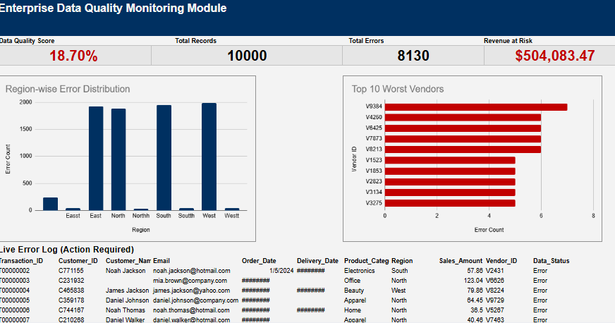

# Enterprise Data Quality Monitoring Pipeline 📊

**Live Interactive Dashboard:** [View the Live Project Here](https://docs.google.com/spreadsheets/d/17w9ZHGdxiX_7K5y0eY_X1eLQt9gmGB7gElBveJhrIpQ/edit?usp=sharing)

## 📌 Project Overview
Engineered a fully automated Data Quality (DQ) monitoring module without utilizing traditional BI software. This custom ETL pipeline leverages advanced spreadsheet logic to audit 10,000 transaction records instantly. It systematically flags structural anomalies, calculates real-time data health scores, and exposes hidden financial risks to stakeholders.

## 🛠️ Tools & Architecture
* **Frontend UI:** Google Sheets 
* **Backend Logic Gate:** Nested Logical Functions (`IF`, `AND`, `OR`, `ISERROR`)
* **Data Aggregation:** SQL-like querying within the spreadsheet (`QUERY`, `FILTER`, `SUMIFS`, `COUNTIFS`)

## ⚙️ The Validation Engine
Instead of relying on manual data cleaning, I built a row-by-row logic gate that automatically flags structural anomalies:
* **Duplicate Transactions:** Utilized `COUNTIF` logic to identify recurring unique IDs.
* **Missing Essential Fields:** Deployed `ISBLANK` parameters to catch null values in critical columns (Name, Email, Region).
* **Invalid Formats:** Implemented string searching functions to flag emails missing standard domain markers.
* **Financial Anomalies:** Designed checks to identify negative sales amounts and future-dated orders.

## 📈 Key Business Impact Metrics
* **Total Records Analyzed:** 10,000
* **Total Errors Flagged:** 8,130
* **Data Quality Score:** 18.7%
* **Revenue at Risk:** $504,083.47

## 📂 Repository Structure
* `Raw_DQ_Transactions.csv`: The initial raw dataset containing intentionally injected errors.
* `Data_Quality_Monitoring_Dashboard.pdf`: Static export of the executive dashboard and error distributions.
* `dashboard_preview.png`: High-resolution UI snapshot.
